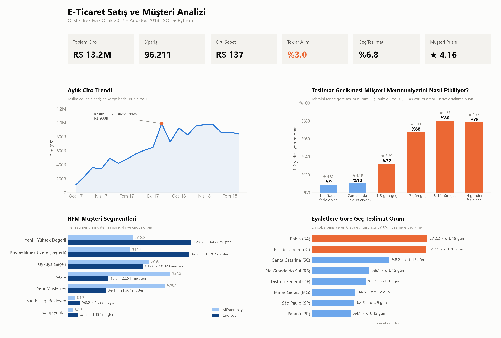
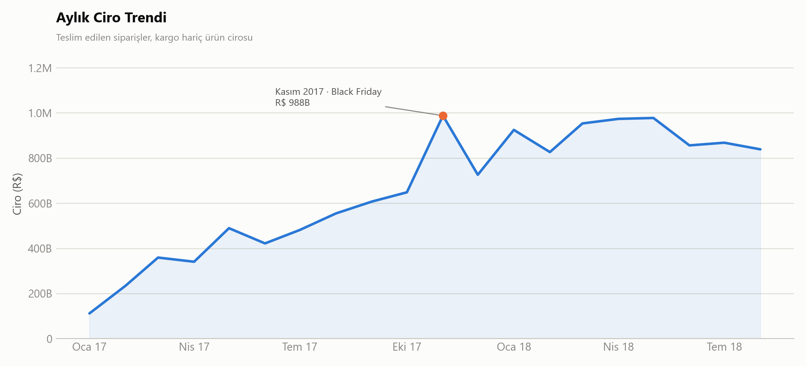
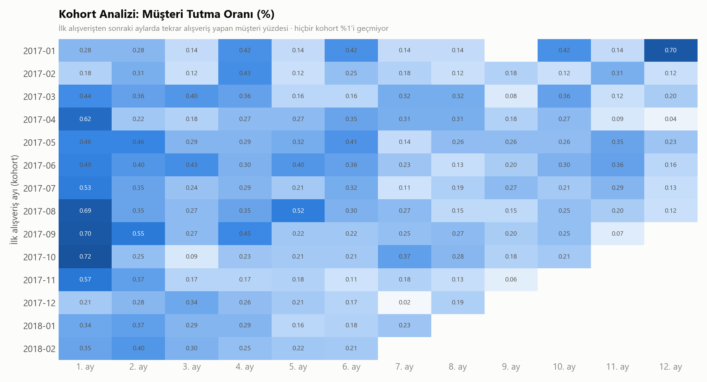
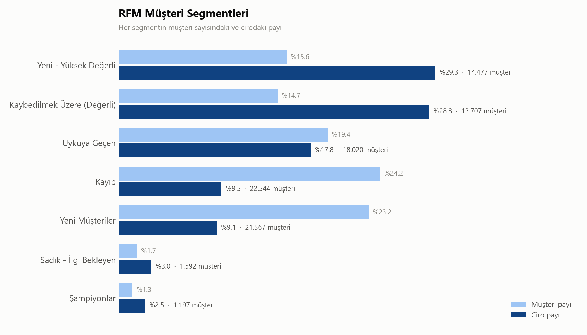
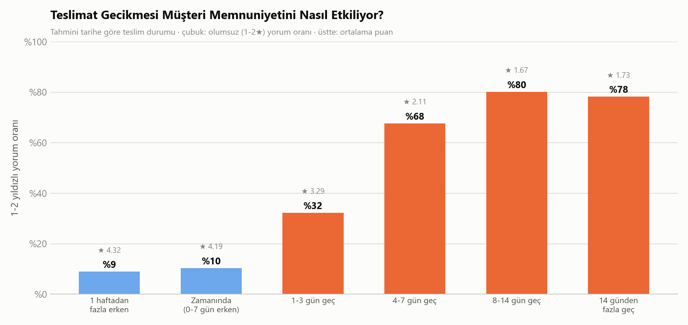
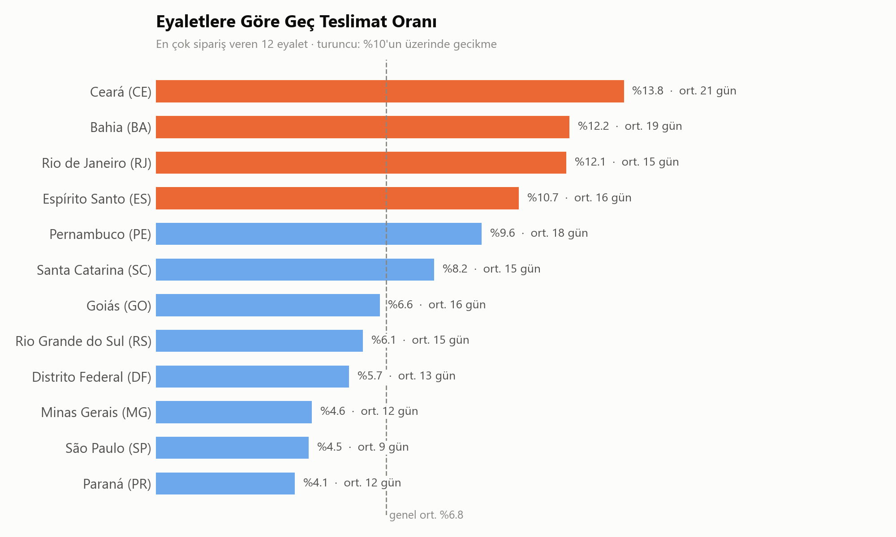
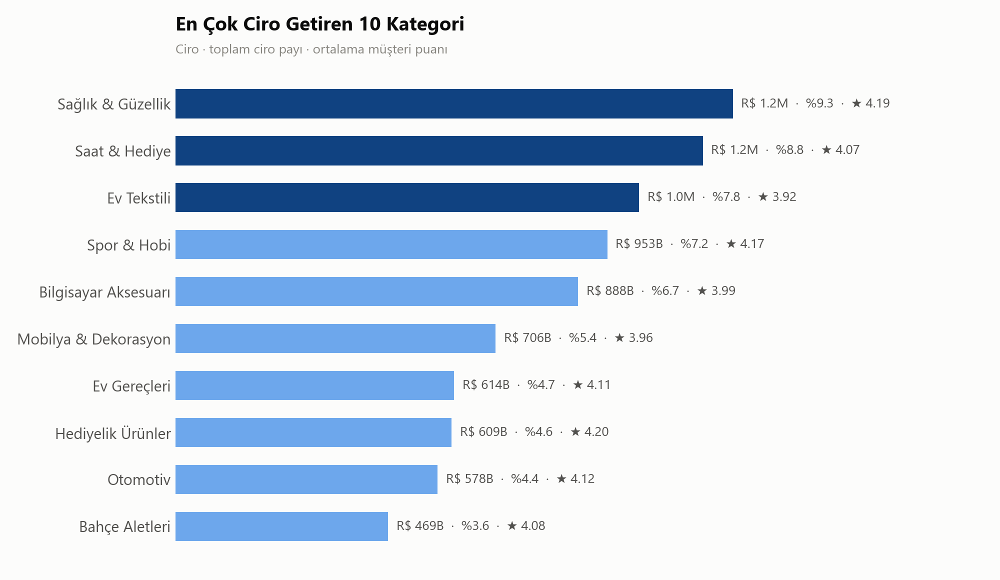
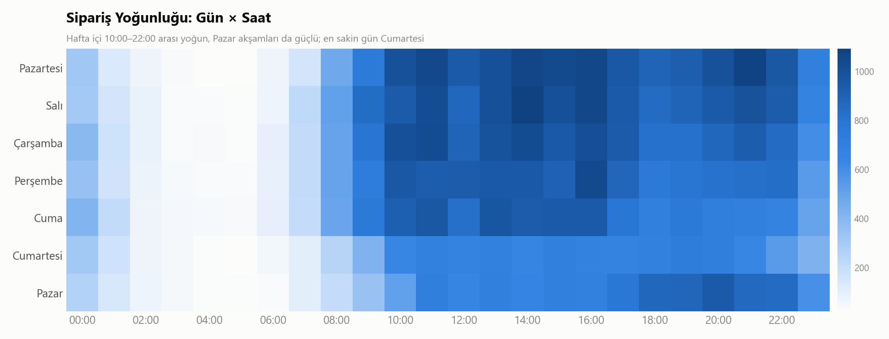

# E-Ticaret Satış ve Müşteri Analizi

Brezilya'nın en büyük pazaryerlerinden **Olist**'in gerçek sipariş verisiyle (~96 bin sipariş, 9 ilişkili tablo)
satış performansı, müşteri segmentasyonu (RFM), müşteri tutma (kohort) ve teslimat–memnuniyet
ilişkisini inceleyen uçtan uca bir veri analizi projesi. Analizlerin tamamı **SQL** ile yapılmış,
görselleştirme ve raporlama **Python** ile üretilmiştir.



## İş Problemi

Yönetim, platformun hızla büyüdüğünü ancak müşterilerin sadık kalmadığını düşünüyor. Analiz şu sorulara cevap arar:

1. **Satış performansı:** Ciro zaman içinde nasıl değişiyor? Hangi kategoriler ve bölgeler ciroyu sürüklüyor?
2. **Müşteri segmentasyonu:** Müşterilerimiz kimler? Hangileri değerli, hangileri kaybedilmek üzere?
3. **Müşteri tutma:** İlk alışverişten sonra müşterilerin yüzde kaçı geri dönüyor?
4. **Teslimat ve memnuniyet:** Teslimat gecikmesi müşteri puanını ne kadar etkiliyor?
5. **Aksiyon:** Geliri ve müşteri sadakatini artırmak için neler yapılmalı?

## Temel Metrikler

| Toplam Ciro | Sipariş | Müşteri | Ort. Sepet | Tekrar Alım Oranı | Geç Teslimat | Ort. Müşteri Puanı |
|---|---|---|---|---|---|---|
| R$ 13,2M | 96.211 | 93.104 | R$ 137 | **%3,0** | %6,8 | 4,16 / 5 |

*Kapsam: teslim edilmiş siparişler, Ocak 2017 – Ağustos 2018. Ciro = ürün fiyatları toplamı (kargo hariç).*

## Bulgular

### 1. Platform hızla büyüdü, ancak 2018'de büyüme durdu
- Ocak–Ağustos 2018 cirosu, önceki yılın aynı dönemine göre **%141 arttı** (R$ 3,0M → R$ 7,2M).
- **Kasım 2017 (Black Friday)** en yüksek ay oldu: sipariş sayısı Ekim'e göre **%63** arttı.
- Ancak Ocak 2018'den itibaren aylık ciro **R$ 0,83–0,98M bandında yatay** seyrediyor. Büyüme yeni müşteri kazanımına dayanıyor ve bu kaynak doygunluğa ulaşmış görünüyor.



### 2. Asıl sorun: müşteriler geri dönmüyor
- Müşterilerin yalnızca **%3'ü** ikinci kez alışveriş yapmış.
- Kohort analizine göre ilk alışverişten 1 ay sonra geri dönen müşteri oranı ortalama **%0,5**. Hiçbir kohortta bu oran **%1'i geçmiyor**.
- Bu nedenle ciro neredeyse tamamen yeni müşteri kazanımına bağımlı; bu da pahalı ve sürdürülmesi zor bir büyüme modeli.



### 3. Cironun %29'u "kaybedilmek üzere" olan değerli müşterilerde
RFM segmentasyonu (Recency, Frequency, Monetary):
- **Kaybedilmek Üzere (Değerli):** 13.707 müşteri (%14,7), cironun **%28,8**'i. Ortalama harcamaları R$ 277, ancak son alışverişlerinin üzerinden ortalama **392 gün** geçmiş.
- **Yeni – Yüksek Değerli:** 14.477 müşteri, cironun %29,3'ü. Bu müşteriler ikinci alışverişe yönlendirilmezse bir sonraki "kaybedilmek üzere" grubunu oluşturacak.
- Birden fazla alışveriş yapan **Şampiyonlar + Sadık** müşteriler toplam müşterilerin yalnızca %3'ü.



### 4. Geç teslimat memnuniyeti çökertiyor
- Zamanında teslim edilen siparişlerde olumsuz yorum (1–2 yıldız) oranı **%9–10**, ortalama puan **4,2–4,3**.
- **4–7 gün geciken** siparişlerde olumsuz yorum oranı **%68**'e çıkıyor, ortalama puan **2,11**'e düşüyor.
- Siparişlerin **%74'ü tahmini tarihten 1 haftadan fazla erken** teslim ediliyor. Bu da sitede gösterilen tahmini teslim sürelerinin gereğinden uzun olduğunu gösteriyor.



### 5. Lojistik sorunu bölgesel
- **São Paulo** siparişlerin %42'sini ve cironun %38'ini oluşturuyor. Ortalama teslimat süresi 9 gün, geç teslimat oranı %4,5.
- İkinci büyük pazar **Rio de Janeiro**'da geç teslimat oranı **%12,1**, ortalama puan 3,97. **Bahia** ve kuzeydoğu eyaletlerinde teslimat süresi 19–25 güne çıkıyor.



### 6. Kategori ve zamanlama
- İlk 3 kategori (Sağlık & Güzellik, Saat & Hediye, Ev Tekstili) cironun **%26**'sını oluşturuyor.
- **Ofis Mobilyası** (puan 3,52) ve **Ev Tekstili** (3,92), yüksek hacimli kategoriler içinde en düşük puanı alanlar.
- Siparişler hafta içi **10:00–22:00** arasında yoğunlaşıyor. En yoğun gün Pazartesi, en sakin gün Cumartesi (Pazartesi'ye göre %33 daha az sipariş). Pazar akşamları da güçlü.




## Öneriler

| # | Öneri | Hedef segment / alan | Tahmini etki* |
|---|---|---|---|
| 1 | **İkinci alışveriş programı:** İlk siparişten ~30 gün sonra kişiselleştirilmiş kupon ve e-posta | Yeni müşteriler, Yeni – Yüksek Değerli | Tekrar alım oranı %3 → %5 olursa **≈ R$ 255B** ek ciro |
| 2 | **Geri kazanım kampanyası:** Son alışverişi 1 yıl önce olan değerli müşterilere özel teklif | Kaybedilmek Üzere (Değerli) | Grubun %5'i geri dönerse **≈ R$ 190B** |
| 3 | **Bölgesel lojistik iyileştirmesi:** RJ ve kuzeydoğu için kargo firması SLA takibi, gecikme riskinde müşteriye proaktif bildirim | RJ, BA, CE, MA, AL | Olumsuz yorum oranında düşüş, puan artışı |
| 4 | **Tahmini teslim süresini gerçekçi göstermek:** Tahminler ortalama 1 haftadan fazla uzun; kısa tahminin dönüşüme etkisi A/B testi ile ölçülmeli | Ödeme / ürün sayfası | Dönüşüm oranında artış (test edilmeli) |
| 5 | **Kampanya zamanlaması:** Bildirim ve e-postaları hafta içi 10:00–16:00 ve Pazar akşamına planlamak; Black Friday için stok ve lojistiği önceden hazırlamak | Pazarlama | Kampanya verimliliği |
| 6 | **Kategori kalite denetimi:** Ofis Mobilyası ve Ev Tekstili satıcılarında iade / yorum incelemesi | Satıcı yönetimi | Kategori puanında artış |

*\*Kaba tahminlerdir; ortalama sepet ve segment harcaması üzerinden hesaplanmıştır, A/B testi ile doğrulanmalıdır.*

## Veri Seti

[Brazilian E-Commerce Public Dataset by Olist](https://www.kaggle.com/datasets/olistbr/brazilian-ecommerce) (Kaggle).
2016–2018 arası ~100 bin gerçek (anonimleştirilmiş) sipariş; müşteri, sipariş, ürün, ödeme, yorum ve satıcı tabloları.

```
customers ──(customer_id)── orders ──(order_id)── order_items ──(product_id)── products
                              ├──(order_id)── order_payments
                              └──(order_id)── order_reviews
```

## Metodoloji Notları

- **Müşteri kimliği:** `customer_id` her siparişte yeniden üretilir. Gerçek müşteri bazlı analizlerde (RFM, kohort, tekrar alım) `customer_unique_id` kullanıldı. Aksi halde her müşteri tek siparişli görünür.
- **Dönem:** 2016 ve Eylül 2018 sonrası aylarda veri eksik olduğu için analiz 20 tam ayla (Ocak 2017 – Ağustos 2018) sınırlandı.
- **Gecikme:** Tahmini teslim tarihi saat bilgisi içermediğinden karşılaştırma gün bazında yapıldı.
- **RFM:** Müşterilerin ~%97'si tek sipariş verdiği için Frequency 5'li dilimlere bölünmedi; "1 sipariş / 2+ sipariş" olarak ayrıldı. Recency ve Monetary `NTILE(5)` ile puanlandı.

## Kullanılan Teknolojiler

- **SQL (SQLite):** CTE, window fonksiyonları (`NTILE`, `SUM() OVER`), çok tablolu JOIN'ler
- **Python:** Pandas, NumPy
- **Matplotlib:** Özel tasarım sistemiyle görselleştirme

## Proje Yapısı

```
ecommerce-sales-performance-analysis/
├── data/
│   ├── raw/                  # Kaggle'dan indirilen CSV'ler (repoya dahil değil)
│   └── processed/            # SQLite veritabanı (repoya dahil değil)
├── sql/
│   ├── 00_kpi_ozet.sql
│   ├── 01_aylik_satis.sql
│   ├── 02_kategori_performansi.sql
│   ├── 03_eyalet_performansi.sql
│   ├── 04_rfm_segmentasyonu.sql
│   ├── 05_kohort_analizi.sql
│   ├── 06_teslimat_memnuniyet.sql
│   └── 07_gun_saat_yogunlugu.sql
├── src/
│   ├── load_data.py          # CSV → SQLite
│   └── analysis.py           # SQL sorgularını çalıştırır, tablo ve grafik üretir
├── outputs/
│   ├── tables/               # Sorgu sonuçları (CSV) — Power BI / Excel kaynağı
│   └── *.png                 # Grafikler
└── README.md
```

## Çalıştırma

```bash
pip install -r requirements.txt

# 1. Kaggle'dan veri setini indirip CSV'leri data/raw/ klasörüne çıkarın
# 2. Veritabanını oluşturun
python src/load_data.py
# 3. Analizleri çalıştırın
python src/analysis.py
```
